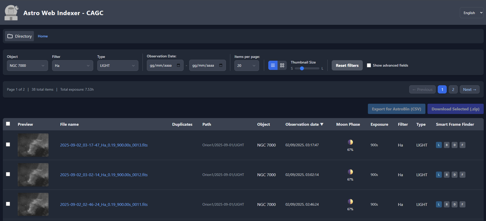

#  Astro Web Indexer

*Stop navigating folders. Start exploring your sky.*

[](https://www.gnu.org/licenses/gpl-3.0)

A web-based file indexer and viewer for astronomical data, supporting both FITS and XISF formats. This tool is particularly useful for shared or remote observatories, but also for any astrophotographer looking to track their imaging sessions over time without getting lost navigating filesystem folders. It helps organize, browse, and analyze image files through an intuitive web interface.

## 🧪 Project Status

**Beta Phase:** All v1.x.x releases are considered beta. During this phase, development may be rapid and include breaking changes. The goal is to gather wider user feedback to achieve a stable v2.0.0 release.

## ▶️ Preview


## ❤️ Support the Project

This project is developed and maintained in my spare time. If you find it useful, please consider supporting its development with a small donation. Thank you!

[](https://www.paypal.com/donate/?business=Y85DQZAEYTF94&no_recurring=0&currency_code=EUR)

## 🚀 Features

### Core Functionality
- 📁 Browse and search FITS and XISF files in a directory structure
- 🔍 Advanced filtering by object, filter type, and image type
- 🔄 Real-time monitoring and automatic indexing of new files
- 🖼️ Built-in preview generation (full and 100% crop) with a non-linear MTF stretch
- 👁️ Calculates Field of View (FoV) and angular resolution based on FITS header data
- 🌘 Calculates Moon phase for each image at the time of acquisition
- 📥 Bulk download functionality with ZIP compression

### 🔬 Smart Frame Finder (SFF)
A powerful search engine to find matching calibration frames (darks, flats, bias) or similar, stackable `LIGHT` frames using a flexible, tolerance-based rules engine.

- **Find Stackable Lights:** Beyond calibration, SFF can find other light frames of the same object with similar celestial coordinates (`RA`/`DEC`), rotation, and field of view, making it easy to identify all stackable exposures of a target, even across different nights.
- **Context-Aware Search:** Start a search directly from a `LIGHT` frame to find matching calibration files. The system knows which parameters are relevant for each calibration type (e.g., `EXPTIME` for darks, `FILTER` for flats).
- **Flexible Rules Engine:** Activate and deactivate search criteria on the fly. You can match by `CCD-TEMP`, `BINNING`, `INSTRUME`, and many other FITS headers.
- **Tolerance Sliders:** Don't need an exact match? Use intuitive sliders to define acceptable tolerances for parameters like temperature (`±2°`), date (`±30 days`), or exposure (`±10%`).
- **Dedicated Interface:** The SFF operates in a dedicated modal window, allowing you to build complex queries, view results, and download a `.zip` archive of the selected frames without leaving the main page.

### 🌌 AstroBin Integration
- **CSV Export for Sessions:** Select multiple files (lights, darks, flats, bias) and copy a pre-formatted CSV string to your clipboard, ready to be pasted into AstroBin's session importer.
- **Smart Session Aggregation:** The exporter intelligently groups exposures into "astro-nights" (from noon to noon), correctly handling sessions that span across midnight.
- **Calibration Frame Counting:** Automatically counts the number of selected dark, flat, and bias frames and adds them to the session data.

### ‼️Duplicate Management
The indexer includes a powerful suite for identifying and managing duplicate files, ensuring a clean and efficient archive.
- **Content-Based Duplicate Detection:** Files are identified as duplicates based on their content hash (`xxhash`), regardless of their name or location.
- **Smart Duplicate Badge:** The main file table displays an intelligent badge in the format `Visible / Total` for files that have duplicates.
- **Interactive Management Modal:** A dedicated interface to view, hide, and restore duplicate files.
- **Sort by Duplicates:** The main table can be sorted by the number of visible duplicates, making it easy to find and manage files with the most copies.

### 🗃️ Resilient Indexing & Soft-Delete

The indexing engine is designed to be both efficient and resilient, making it suitable for managing large and dynamic data archives.

- **Fast Rescans:** The indexer uses a combination of file modification time (`mtime`) and size to quickly skip files that have not changed since the last scan. This makes subsequent indexing runs extremely fast.
- **Content-Based Identification:** Files are uniquely identified by their `xxhash`, a high-speed hashing algorithm.
- **Soft-Delete Recovery:** When a file is removed from the filesystem, it is not immediately deleted from the database. Instead, it is marked as "deleted" for a configurable retention period (default: 30 days). This provides a safety net against accidental deletions or temporary filesystem unavailability. If the file reappears within the retention period, it is instantly restored without need of full reindexing and hash calculation.

### User Experience
- 🌐 Multilingual interface (English, Italian, French, Spanish, and German)
- 📱 Responsive design for mobile and desktop
- 🎨 Modern, dark-themed interface
- ⚡ Fast and efficient file browsing

### Technical Features
- 🐳 Dockerized deployment for easy setup
- 🗄️ MariaDB backend with schema migrations managed by **Phinx**.
- 🔒 Secure file handling and access control
- 📊 Extensive FITS/XISF header metadata extraction and indexing.

## 📋 Requirements

- Docker
- Docker Compose

## ⚡ Quick Start (for Users)

This method uses pre-built Docker images and is the recommended way to get started quickly.

1.  **Download the Release Files**
    - Go to the [**latest release page**](https://github.com/michelegz/astro-web-indexer/releases/latest).
    - Under the "Assets" section, download the `astro-web-indexer-vX.X.X.zip` file.

2.  **Unzip and Prepare**
    - Unzip the downloaded file. It contains a `docker-compose.yml` and an `.env.example` file.
    - Create your environment file by copying the example:
      ```bash
      cp .env.example .env
      ```
    - Edit `.env` file to your needs

3.  **Prepare Your Data Directory**
    - Create a `data/fits` directory and place your FITS/XISF files inside.
      ```bash
      mkdir -p data/fits
      ```
    - Alternatively, edit the `.env` file to point `FITS_DATA_PATH` to your existing image folder (e.g., `FITS_DATA_PATH=/path/to/my/images`).

4.  **Start the Application**
    - Run the following command from the same directory where you unzipped the files:
      ```bash
      docker compose up -d
      ```

5.  **Access the Application**
    - Open your browser and navigate to http://localhost:2080 (or the port you configured in `.env`). The first indexing process will start automatically in the background.


## ⚙️ Configuration

All configuration is handled via environment variables, typically set in a `.env` file.

### 🌍 Core Application

| Variable | Description | Default |
|----------|-------------|---------|
| `NGINX_PORT` | The port to expose the web interface on the host machine. | `2080` |
| `HEADER_TITLE` | The main title displayed in the application header. | `Astro Web Indexer` |
| `FITS_DATA_PATH` | The **host path** to the directory containing your FITS files. This directory will be mounted into the containers. | `./data/fits` |

### 🗃️ Indexing Service

These variables control the behavior of the Python indexing and watching scripts.

| Variable | Description | Default |
|----------|-------------|---------|
| `RETENTION_DAYS` | The number of days to keep a record of a deleted file in the database before it is permanently purged. Set to `0` to disable purging. | `30` |
| `DEBUG` | Enables verbose debug logging for the indexing scripts. Set to `true` or `false`. | `false` |
| `THUMB_SIZE` | The size (width and height) in pixels for generated thumbnails. | `300` |

### 🗄️ Database Connection

These variables are shared across all services to connect to the MariaDB container. **Ensure they are consistent everywhere.**

| Variable | Description | Default |
|----------|-------------|---------|
| `DB_HOST` | The hostname of the database service. Should match the service name in `docker-compose.yml`. | `mariadb` |
| `DB_NAME` | The name of the database to be created and used. | `awi_db` |
| `DB_USER` | The username for the database. | `awi_user` |
| `DB_PASSWORD` | The password for the database user. | `awi_password` |
| `MYSQL_ROOT_PASSWORD` | The root password for the MariaDB server. **It is highly recommended to change this.** | `rootpassword` |

### 🎨 Custom Logo

You can replace the default logo with your own by mapping a local SVG file. 

1.  Open the `docker-compose.yml` file.
2.  Locate the `php` service.
3.  Uncomment the volume mapping for the custom logo and replace `./path/to/your/logo.svg` with the actual path to your file.

```yaml
services:
  php:
    # ... other settings
    volumes:
      - ${FITS_DATA_PATH:-./data/fits}:/var/fits:ro
      # To use a custom logo, uncomment the following line and
      # replace ./path/to/your/logo.svg with the actual path to your logo file.
      - ./path/to/your/logo.svg:/var/www/html/assets/logo/custom_logo.svg:ro
```
The application will automatically use your logo. If this volume is not mapped, it will fall back to the default logo.


## 🤝 Contributing & Development

This project welcomes contributions! If you are a developer and want to build the project from the source code, please read our **[Contributing Guide](CONTRIBUTING.md)** for detailed instructions on setting up a development environment.


## 📜 License

This project is licensed under the GNU General Public License v3.0 - see the [LICENSE](LICENSE) file for details.

## 🙏 Acknowledgements

This project is built upon the hard work of many open-source projects, including:

- **[XISF Python Library](https://github.com/sergio-dr/xisf)** by Sergio Díaz for XISF file support.
- **[Astropy](https://www.astropy.org/)** for FITS file handling and astronomical calculations.
- **[Watchdog](https://github.com/gorakhargosh/watchdog)** for file system monitoring.
- **PHP**, **Python**, **MariaDB**, and **Nginx** as the core technology stack.
- **[Tailwind CSS](https://tailwindcss.com/)** for the user interface design.

## ⚠️ Disclaimer

This software provided "as is". The author is not responsible for any data loss, corruption, or other issues. **Always maintain backups of your data.** Use at your own risk.

